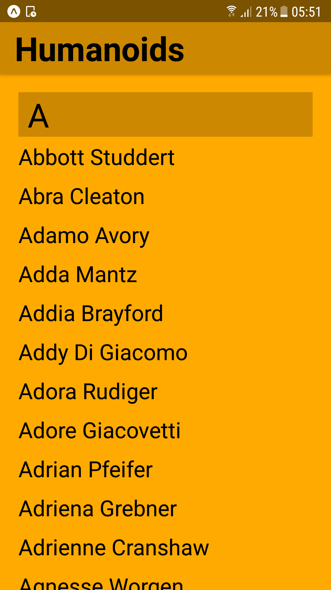
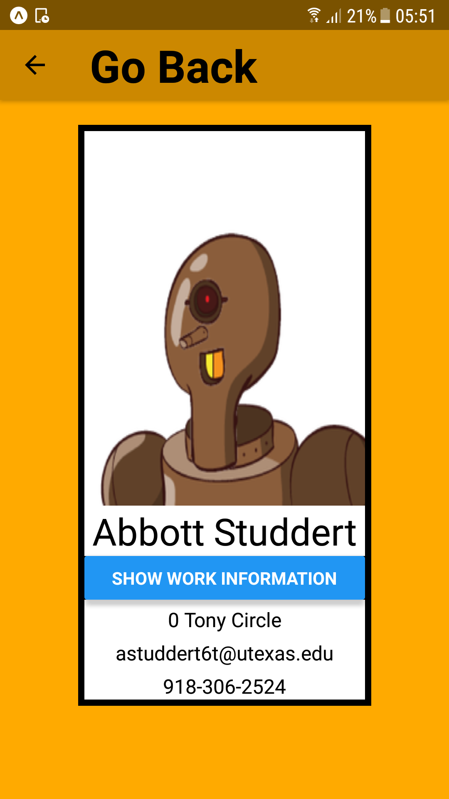

# DetailList
A simple phone application written in react-native, developed and tested on android devices using Expo as part of a course in app development for Reykjavík University.

The provided data set is used in conjunction with the SectionList component included in react-native to produce a large, scrollable sectioned list. 

Each item on the list can then be pushed to navigate to a custom component featuring a unique image and a button which provides a toggle  displaying the contact's work or home information.

  
  

